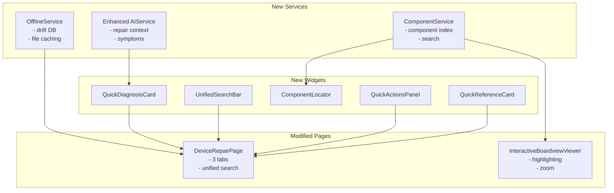

# RepairAI Implementation Plan - Speed & Simplicity Improvements

## Current State Analysis

**Existing Flow:**
- Manufacturer dropdown → Model dropdown → Files tab → Chat tab
- Basic AI context: device info + schematic file list only
- Two tabs: Files + Chat
- SharedPreferences-based caching (manufacturers, files)
- Boardview viewer shows placeholder for binary PCB files

**Gaps Identified:**
1. No symptom-based navigation
2. No component search functionality
3. AI lacks repair workflow context
4. No offline download capability
5. No unified search
6. No quick action buttons

---

## Phase 1: Quick Wins (This Week)

### 1.1 Add Symptom-Based Navigation
**File:** [`device_repair_page.dart`](lib/features/device/presentation/pages/device_repair_page.dart)

**Implementation:**
- Add `commonSymptoms` list to DeviceRepairPage
- Create `QuickDiagnosisCard` widget showing symptom chips
- When symptom selected → auto-filter relevant schematics + trigger AI analysis
- Add to top of Files tab

```dart
List<String> commonSymptoms = [
  "Won't turn on",
  "No display",
  "Not charging", 
  "No sound",
  "WiFi/Bluetooth issues",
  "Camera not working",
  "Overheating",
  "No SIM detected"
];
```

**Changes:**
- [ ] Add symptom list to state
- [ ] Create QuickDiagnosisCard widget
- [ ] Add symptom filtering logic for schematics
- [ ] Auto-trigger AI analysis when symptom selected

---

### 1.2 Enhance AI Prompts for Repair Context
**File:** [`ai_service.dart`](lib/shared/services/ai_service.dart)

**Implementation:**
- Improve system prompt to understand repair workflows
- Add symptom → component mapping knowledge
- Include test point expectations
- Add common failure patterns per model

**Changes:**
- [ ] Update system prompt in `_sendToOpenRouter()`
- [ ] Add enhanced context builder in device_repair_page.dart
- [ ] Include symptom-specific troubleshooting steps
- [ ] Add test point and voltage value guidance

---

### 1.3 Add Quick Reference Cards
**File:** New widget in [`device_repair_page.dart`](lib/features/device/presentation/pages/device_repair_page.dart)

**Implementation:**
- Create `QuickReferenceCard` widget
- Show at-a-glance info:
  - Common ICs on this model
  - Typical voltage values
  - Screw sizes and locations
  - Disassembly difficulty rating

**Changes:**
- [ ] Create QuickReferenceCard widget
- [ ] Add to sidebar or as collapsible panel
- [ ] Populate with static data for common models

---

## Phase 2: Core Features (Next Week)

### 2.1 Unified Search Bar
**File:** [`device_repair_page.dart`](lib/features/device/presentation/pages/device_repair_page.dart)

**Implementation:**
- Replace two dropdowns with single smart search bar
- Auto-complete manufacturer/model from index
- Search across: model numbers, symptoms, component names
- Show relevant files immediately
- Start AI analysis automatically

**Changes:**
- [ ] Create UnifiedSearchBar widget
- [ ] Implement autocomplete from GitHub index
- [ ] Add search results filtering
- [ ] Auto-navigate to relevant schematics

---

### 2.2 Component Search/Locator
**File:** New [`component_locator.dart`](lib/shared/widgets/component_locator.dart)

**Implementation:**
- Search by reference designator (e.g., "U5201")
- Search by function (e.g., "charging IC")
- Highlight component on schematic/boardview
- Show component details panel:
  - Specifications
  - Common failures
  - Replacement part numbers

**Changes:**
- [ ] Create ComponentLocator widget
- [ ] Add component index database
- [ ] Implement search with autocomplete
- [ ] Add highlight overlay for boardview
- [ ] Create component detail panel

---

### 2.3 Offline Download Feature
**File:** New [`offline_service.dart`](lib/shared/services/offline_service.dart)

**Implementation:**
- Add "Download for Offline" button per device
- Cache complete device packages (schematics + solutions)
- Local SQLite database for offline search
- Download progress indicator
- Manage offline storage (delete old packages)

**Changes:**
- [ ] Create OfflineService with drift database
- [ ] Add download UI to device selector
- [ ] Implement file caching
- [ ] Add storage management UI

---

### 2.4 Tab Consolidation
**File:** [`device_repair_page.dart`](lib/features/device/presentation/pages/device_repair_page.dart)

**Implementation:**
- Replace Files + Chat with Diagnosis + Repair + Reference
- **Diagnosis Tab:** Symptoms + AI chat
- **Repair Tab:** Schematics + repair procedures
- **Reference Tab:** Component locator + quick reference cards

**Changes:**
- [ ] Update TabController to 3 tabs
- [ ] Create DiagnosisTab widget
- [ ] Create RepairTab widget (combine files + solutions)
- [ ] Create ReferenceTab widget

---

### 2.5 Quick Actions Panel
**File:** New floating panel in [`device_repair_page.dart`](lib/features/device/presentation/pages/device_repair_page.dart)

**Implementation:**
- Floating action buttons for common tasks:
  - 📏 Measure: Opens multimeter reference
  - 🔍 Find Component: Opens component search
  - 📋 Checklist: Diagnostic checklist
  - 📸 Compare: Compare with known-good board

**Changes:**
- [ ] Create QuickActionsPanel widget
- [ ] Add floating action button menu
- [ ] Implement each quick action handler

---

## Phase 3: Advanced Features (Month End)

### 3.1 Image Analysis Integration
**File:** [`pubspec.yaml`](pubspec.yaml) + new service

**Implementation:**
- Add TFLite Flutter for ML component recognition
- Allow users to upload board photos
- Auto-identify components from image
- Suggest relevant schematics

**Changes:**
- [ ] Add tflite_flutter to pubspec.yaml
- [ ] Create ImageAnalysisService
- [ ] Add photo capture/upload UI
- [ ] Implement component recognition

---

### 3.2 Visual Component Highlighting
**File:** [`interactive_boardview_viewer.dart`](lib/features/schematic/presentation/widgets/interactive_boardview_viewer.dart)

**Implementation:**
- Color-coded components by type:
  - Red: Power-related (common failures)
  - Blue: Signal/RF
  - Green: Audio
  - Yellow: Display
- Double-click component → zoom to location
- Click component → show details popup

**Changes:**
- [ ] Add component color coding
- [ ] Implement zoom-to-component
- [ ] Create component detail popup
- [ ] Add touch/click interaction

---

### 3.3 Repair Procedure Integration
**File:** New widgets in [`device_repair_page.dart`](lib/features/device/presentation/pages/device_repair_page.dart)

**Implementation:**
- When viewing schematic section → show related repair steps
- Step-by-step repair procedure
- Required tools list
- Estimated time
- Common pitfalls warnings

**Changes:**
- [ ] Create RepairProcedurePanel widget
- [ ] Link schematics to repair guides
- [ ] Add tools checklist
- [ ] Add time estimates

---

### 3.4 Community Knowledge Base
**File:** New features in existing community page

**Implementation:**
- Rate solution effectiveness (1-5 stars)
- Add notes to schematics
- Share repair tips
- Upload success photos

**Changes:**
- [ ] Add solution rating system
- [ ] Create schematic annotations
- [ ] Add tip sharing UI
- [ ] Implement photo upload

---

## Technical Architecture

### Mermaid: New Service Architecture



### Database Schema (Drift)

```dart
// Tables to add
class DevicePackages extends Table {
  TextColumn get manufacturer => text()();
  TextColumn get model => text()();
  DateTimeColumn get downloadedAt => dateTime()();
  IntColumn get sizeBytes => integer()();
}

// Component knowledge base
class Components extends Table {
  TextColumn get reference => text()();
  TextColumn get function => text()();
  TextColumn get commonFailures => text()();
  TextColumn get replacementPart => text()();
}

// Solution ratings
class SolutionRatings extends Table {
  TextColumn get solutionPath => text()();
  IntColumn get rating => integer()();
  TextColumn get userNote => text().nullable()();
}
```

---

## Implementation Priority Summary

| Phase | Feature | Priority | Complexity |
|-------|---------|----------|------------|
| 1.1 | Symptom-based navigation | P0 | Low |
| 1.2 | Enhanced AI prompts | P0 | Low |
| 1.3 | Quick reference cards | P1 | Low |
| 2.1 | Unified search bar | P0 | Medium |
| 2.2 | Component locator | P0 | Medium |
| 2.3 | Offline download | P1 | Medium |
| 2.4 | Tab consolidation | P1 | Medium |
| 2.5 | Quick actions panel | P2 | Low |
| 3.1 | Image analysis | P2 | High |
| 3.2 | Visual highlighting | P2 | Medium |
| 3.3 | Repair procedures | P2 | Medium |
| 3.4 | Community features | P3 | High |

---

## Next Steps

1. **Approve this plan** - Confirm phases and priorities
2. **Start Phase 1** - Implement quick wins
3. **Iterate** - Gather feedback and adjust

The plan focuses on:
- **Speed**: Reducing clicks from 4+ to 1-2
- **Simplicity**: One search → immediate results
- **Power**: Expert-level repair knowledge when needed
- **Offline**: Work without internet connection
